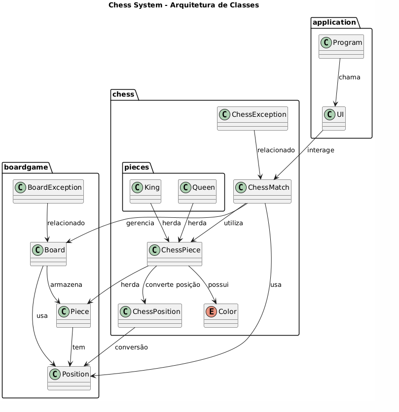

# ♟️ Chess Game Java Project
### Projeto desenvolvido em Java sendo parte do curso "Java COMPLETO - Programação Orientada a Objetos + Projetos", com foco em programação orientada a objetos. O sistema implementa um jogo de xadrez, com tabuleiro 8x8, regras de movimentação das peças, detecção de xeque e xequemate, e jogadas especiais como roque e promoção de peão.

# 🚀 Getting Started

## Requisitos
### ☕ Java 17 ou superior
### 🔧 Maven ou sua IDE favorita configurada para projetos Java
### 📝 Conhecimentos básicos de Xadrez e Java OO

# 🔨 Instalação
## 1- Clone o repositório:
### git clone https://github.com/seu-usuario/chess-game-java.git

## 2 - Compile e rode a aplicação (caso tenha uma interface CLI, ou teste via código):
### mvn clean install
### mvn exec:java -Dexec.mainClass="your.main.ClassName"

# Chess system - Arquitetura de classe

# 🎮 Arquitetura do Projeto
| Pacote / Classe  | Responsabilidade                                |
| ---------------- | ----------------------------------------------- |
| `ChessMatch`     | Controla o fluxo do jogo, movimentos e regras   |
| `ChessPiece`     | Representa peças de xadrez com cor e movimentos |
| `Board`          | Representa o tabuleiro e suas posições          |
| `ChessPosition`  | Faz conversão entre notação algébrica e matriz  |
| `Color`          | Enum para cores das peças (`WHITE`, `BLACK`)    |
| `ChessException` | Exceções específicas para erros no jogo         |

# 🛣️ API Pública (Métodos Principais)
| Método                                                                    | Descrição                                                             | Status/Retorno                 |
| ------------------------------------------------------------------------- | --------------------------------------------------------------------- | ------------------------------ |
| `ChessMatch.performChessMove(ChessPosition source, ChessPosition target)` | Realiza um movimento de peça no tabuleiro, tratando regras            | Move executado ou exceção      |
| `ChessMatch.possibleMoves(ChessPosition source)`                          | Retorna matriz booleana com movimentos possíveis para peça na posição | Matriz de booleanos            |
| `ChessMatch.replacePromotedPiece(String type)`                            | Substitui peça promovida (ex: `"Q"`, `"R"`)                           | Peça promovida                 |
| `ChessMatch.getTurn()`                                                    | Retorna o número do turno atual                                       | int                            |
| `ChessMatch.getCurrentPlayer()`                                           | Retorna cor do jogador atual (`Color`)                                | `Color.WHITE` ou `Color.BLACK` |
| `ChessMatch.getCheck()`                                                   | Indica se o jogador atual está em xeque                               | boolean                        |
| `ChessMatch.getCheckmate()`                                               | Indica se houve xeque-mate                                            | boolean                        |

# 📋 Exemplos de Uso

## Realizar um movimento
ChessMatch match = new ChessMatch();

ChessPosition source = new ChessPosition('e', 2);
ChessPosition target = new ChessPosition('e', 4);

match.performChessMove(source, target);

## Consultar movimentos possíveis de uma peça
boolean[][] moves = match.possibleMoves(new ChessPosition('b', 1));

## Promover um peão para torre
match.replacePromotedPiece("R");

# ⚙️ Regras Suportadas
| Recurso            | Descrição                                       |
| ------------------ | ----------------------------------------------- |
| Movimentos básicos | Movimentação tradicional de peças               |
| Roque (castling)   | Pequeno e grande roque                          |
| En passant         | Captura especial de peão                        |
| Promoção de peão   | Promoção automática ao chegar na última fileira |
| Validação de xeque | Detecta xeque e impede movimentos ilegais       |
| Xeque-mate         | Detecta fim de jogo                             |

# ⚠️ Tratamento de Erros
| Classe           | Cenário                                                                  |
| ---------------- | ------------------------------------------------------------------------ |
| `ChessException` | Erros na lógica do jogo de xadrez (movimento inválido, peça inexistente) |
| `BoardException` | Erros de tabuleiro (posição fora do alcance, etc)                        |

## Exemplo:
try {
match.performChessMove(source, target);
} catch (ChessException e) {
System.out.println("Erro: " + e.getMessage());
}

# 🧱 Estrutura do Projeto
src/
│
├── application/              → Ponto de entrada e interação com o usuário
│   ├── Program.java          → Classe principal (main)
│   └── UI.java               → Interface de console (entrada e saída)
│
├── boardgame/                → Camada genérica de tabuleiro
│   ├── Board.java            → Representa o tabuleiro
│   ├── BoardException.java   → Exceções relacionadas ao tabuleiro
│   ├── Piece.java            → Classe genérica de peça
│   └── Position.java         → Representa posições no tabuleiro
│
└── chess/                    → Lógica específica do jogo de xadrez
├── ChessMatch.java       → Controla a partida de xadrez
├── ChessPiece.java       → Representa uma peça de xadrez
├── ChessPosition.java    → Conversão de posições (ex: e2 → matriz)
├── ChessException.java   → Exceções específicas do xadrez
├── Color.java            → Enum para cores das peças (WHITE, BLACK)
└── pieces/               → Peças concretas (Rei, Rainha, Torre, etc.)
├── (King.java)       → Peça Rei
├── (Queen.java)      → Peça Rainha
└── ...

# 📈 Futuras Melhorias
✅ Interface gráfica

🔐 Sistema contra trapaças e jogadas ilegais avançadas

🤖 Implementar inteligência artificial para jogar contra o computador

🐳 Dockerização do projeto

🌐 Versão web com Spring Boot e frontend

# 📚 Disclaimer Educacional
Este projeto foi desenvolvido exclusivamente com fins didáticos como parte do curso Java COMPLETO - Programação Orientada a Objetos + Projetos de Nélio Alves.
Não é um sistema para fins comerciais ou produção real.

# 👤 Autor
#### Matheus Holanda Passos
#### 🔗 GitHub https://github.com/MatheusP4ssos
#### 📧 matheus.senai2016@gmail.com

### ⭐ Se curtir o projeto, não esqueça de dar uma estrela no repositório!
